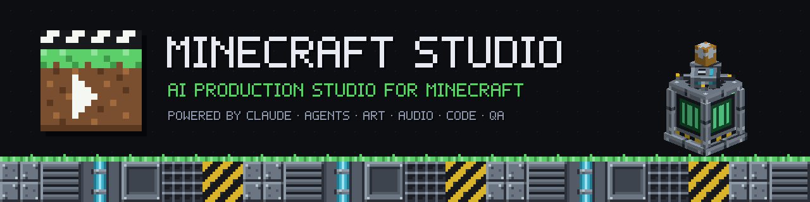
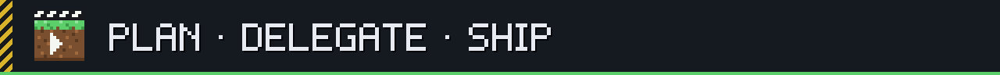
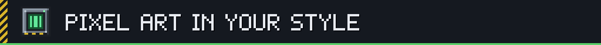
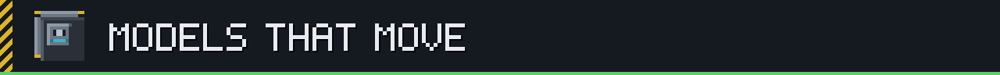
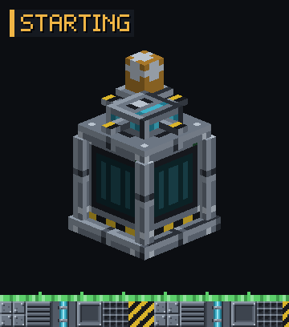
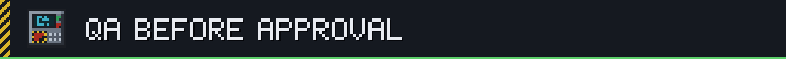
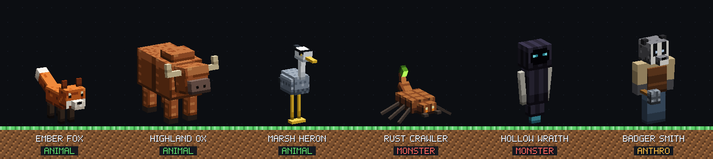
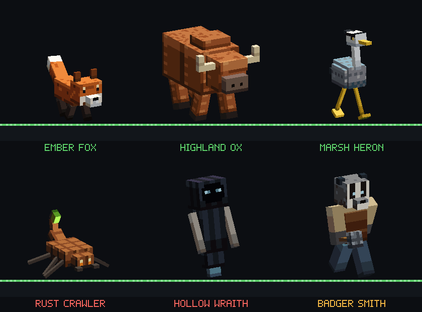
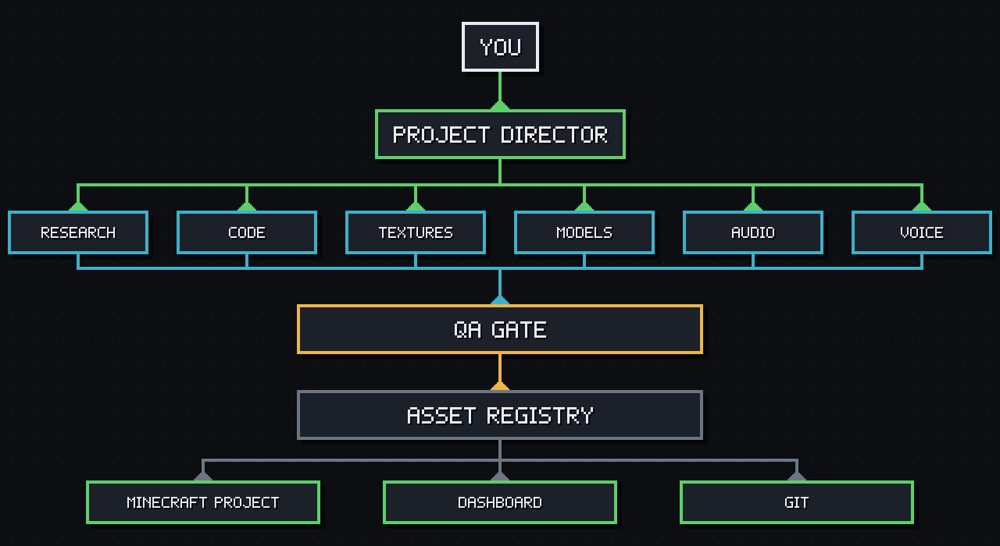

<div align="center">



**[Install](#installation)** · **[Quick start](#quick-start)** · **[Docs](docs/)** · **[Demo project](examples/industrial-reactor)** · **[Report a bug](https://github.com/ArabKustam/Plugin-Minecraft-studio/issues/new/choose)** · **[🇷🇺 Русский](README.ru.md)**

[](CHANGELOG.md)
[](https://github.com/ArabKustam/Plugin-Minecraft-studio/actions/workflows/ci.yml)
[](.claude-plugin/plugin.json)
[](docs/compatibility.md)
[](docs/mcp.md)
[](LICENSE)

</div>

**Minecraft Studio** is a Claude Code plugin that turns Claude into a small game-development studio. You describe a feature, for example "an emergency reactor with sirens, PA announcements and adaptive music". A Project Director agent plans it as a dependency graph and hands the work to 14 specialist agents. Every texture, model, animation, sound, music cue, voice line and piece of code goes through QA, gets documented and is committed to Git. You can follow the whole process in a local dashboard.

<div align="center">

<br><sub>The real Studio Dashboard running on the bundled Industrial Reactor demo. The plugin's own pipeline produced every asset shown.</sub>
</div>

---



The **Project Director** reads your project and its memory, checks Git, and splits the request into tasks. Each task has a contract: goal, inputs, outputs, allowed tools, constraints, quality bar and destination. Independent tasks run as parallel agents. The dashboard shows every task, agent and result.




The studio **measures your existing resource pack**: palette, contrast, saturation, hue shift, outlines, noise, dithering and light direction. The Texture Artist then draws real pixel art against that profile. It does not downscale AI images. Each new texture is scored against the pack, and off-style ones are sent back. State variants are derived from a single base, so they read as the same object.

<p align="center"><br></p>



Models are written as editable sources and exported to **Java block/item models, Bedrock geometry and Blockbench `.bbmodel`**. Animations get anticipation, easing and seamless loops. The studio renders turnarounds and animation frames and **looks at them** before QA, because a file that validates can still look wrong. Live Blockbench editing works through an optional MCP bridge.

<p align="center"> </p>


- **SFX** are built from layered recipes (tone, motor, transient, room, PA speaker), normalised to LUFS targets and exported as mono Ogg Vorbis with `sounds.json` entries.
- **Music** is written as scores with intro, loop and stinger sections, stems, and BPM, key and bar metadata, so the game can switch tracks on bar lines.
- **Voice lines** keep one character across dozens of recordings using voice profiles and a pronunciation dictionary that includes Russian stress. They are generated with ElevenLabs when it is configured and with system TTS otherwise.




An asset is **approved** only after a passing QA record for its current version. Beyond that, the studio runs:

- visual QA, audio QA, code review and integration QA
- builds and unit tests
- resource-pack validation (broken references, pack formats)
- a registry integrity check
- timeline checks against `sounds.json`
- an optional disposable Paper test server with a `selftest` smoke test
- Git checkpoints: Conventional Commits of explicit paths, scanned for secrets

## Examples

Both examples are full productions made with the plugin's own tools. Each can be replayed with `node studio/produce.mjs --fresh`.

### 🧪 [Industrial Reactor](examples/industrial-reactor): Paper 1.21.11 plugin

The plugin has 52 classes and 81 unit tests. It implements a reactor state machine, heat simulation, a display-entity rig, a control-panel GUI, timelines and an adaptive music director. It ships with a studio-made resource pack:

- 16 textures
- 8 models
- 7 SFX
- 2 adaptive music cues
- 5 Russian PA announcements

### 🐾 [Creature Pack](examples/creatures): 3 animals, 2 monsters, 1 anthropomorphic NPC



<div align="center"></div>

| Creature | Type | Rig and animations | Sounds |
|---|---|---|---|
| **Ember Fox** | animal | quadruped · idle, trot, pounce | yip, yelp, snarl |
| **Highland Ox** | animal | shaggy quadruped with horns · grazing idle, walk, headbutt | low call, hurt, impact |
| **Marsh Heron** | animal | long-legged bird · idle, walk, peck, wing flap | croak, squawk, peck clicks |
| **Rust Crawler** | monster | six-legged scrap scorpion · tripod gait, tail sting | chitter, hiss, sting |
| **Hollow Wraith** | monster | hovering hooded spirit · hover, drift, shriek | whisper, wail, shriek |
| **Badger Smith** | anthropomorphic | humanoid badger with a hammer · walk, hammer strike, forge loop | anvil clang, grunt, impact |

Each creature includes:

- a UV-painted 64×64 atlas (`texture_paint_uv`)
- Bedrock geometry and animations
- client and behavior entities with spawn eggs
- 3 sounds
- a Blockbench `.bbmodel`

All of it is packaged as `studio-creatures.mcaddon`, which passes the studio's Bedrock validator. The pack has not been run in a Bedrock client yet. Field guide: [examples/creatures/docs/creatures.md](examples/creatures/docs/creatures.md).

## How it works



The plugin has four layers:

1. **Claude plugin**: skills, agents and hooks.
2. **Agents**.
3. **Orchestration**: the task graph, timelines and the QA lifecycle.
4. **Five MCP servers**: `studio-core`, `studio-texture`, `studio-model`, `studio-audio` and `studio-minecraft`.

External tools plug in through adapters: ElevenLabs, system TTS, Blockbench MCP, GitHub MCP, and the Paper, Fabric, NeoForge, resource-pack and Bedrock adapters. All state is plain JSON in your project under `.minecraft-studio/`. [Architecture →](docs/architecture.md)

## Requirements

| | Needed for |
|---|---|
| **Claude Code** (CLI or desktop) | runs the plugin; Cowork can install the `.plugin` file |
| **Node.js ≥ 20** | the bundled MCP servers (no `npm install`) |
| Git | checkpoints and history *(recommended)* |
| FFmpeg with libvorbis | Ogg export for Minecraft *(recommended)* |
| Java 21 (MC ≤ 1.21.11) or 25 (MC 26.x) + Maven/Gradle | building and testing plugins and mods |
| ElevenLabs API key | production voices, AI SFX and music *(optional)* |
| Blockbench + an MCP bridge | live model editing *(optional)* |

## Installation

```
/plugin marketplace add ArabKustam/Plugin-Minecraft-studio
/plugin install minecraft-studio@minecraft-studio
```

Then restart Claude Code. To try a local checkout without installing it, run `claude --plugin-dir /path/to/Plugin-Minecraft-studio`. More detail, including how to install the `.plugin` file in Cowork, is in [docs/installation.md](docs/installation.md).

## Quick start

```
cd my-minecraft-project
claude
> /minecraft-studio:init
> Make an industrial control panel block in the style of my resource pack,
  with an animated screen and a button click sound.
```

`init` analyses the project and asks about the platform and version if they are unclear. It then indexes your existing assets, profiles your texture style and opens the dashboard. You can run `/minecraft-studio:doctor` at any time to check your setup.

## Configuration

Settings live in `.minecraft-studio/config.json`. Claude changes them with `studio_config_set`. Secrets are never stored there.

| Key | Default | Meaning |
|---|---|---|
| `providers.voice` | `auto` | `auto` (ElevenLabs → system TTS → mock), `elevenlabs`, `system`, `mock` |
| `providers.sfx` / `providers.music` | `local-synth` / `local-composer` | local generators; ElevenLabs tools are separate and ask before spending credits |
| `audio.master_format` | `flac` | lossless master format (`wav` if FFmpeg is missing) |
| `costs.max_generations_per_asset` | `6` | cap on paid generations per asset |
| `dashboard.port` | `4777` | Studio Dashboard port (always bound to 127.0.0.1) |
| `minecraft.accept_eula` | `false` | enables the local Paper test server; set it only after **you** accept the Minecraft EULA |
| `minecraft.startup_timeout_s` | `180` | test-server startup timeout |

| Environment variable | Purpose |
|---|---|
| `ELEVENLABS_API_KEY` | ElevenLabs key; can also go in the plugin option (secure storage) or your project's `.env` |
| `MINECRAFT_STUDIO_CAPABILITIES` | limits each MCP server to `read`, `write`, `execute` or `publish` tools |
| `MINECRAFT_STUDIO_FFMPEG` | path to a specific FFmpeg binary |

## Commands

| Slash command | What it does |
|---|---|
| `/minecraft-studio:init` | analyse and initialise the project, profile its style, start the dashboard |
| `/minecraft-studio:doctor` | diagnose Node, Git, Java, FFmpeg, TTS, ElevenLabs, Blockbench, GitHub and the dashboard |
| `/minecraft-studio:dashboard` | open the Studio Dashboard |

Hooks and CI use a command-line tool: `node runtime/dist/cli.mjs <command>`. Available commands: `doctor`, `init`, `analyze`, `status`, `integrity`, `dashboard`, `validate-pack <dir>`, `package-pack <dir> <zip>`, `scan-secrets`.

## API

Agents work through MCP tools such as `mcp__plugin_minecraft-studio_studio-texture__texture_render_spec`. Every generation tool accepts an `asset` block that registers the output together with the source needed to reproduce it:

```jsonc
// texture_render_spec: the source is a palette plus one character per pixel
{
  "spec": {
    "size": [16, 16],
    "palette": { "o": "#1b1e24", "l": "#6c7683", "h": "#8e99a6", "g": "#62e89a" },
    "rows": ["oooooooooooooooo", "ohhhhhhhhhhhhhlo", "…14 more rows…"]
  },
  "output": "resourcepack/assets/reactor/textures/item/core_side_active.png",
  "purpose": "item",
  "asset": { "id": "reactor.core_side_active.texture", "minecraft_ids": ["reactor:item/core_side_active"], "agent": "texture-artist" }
}
// → the PNG is written, the spec is stored, a review sheet comes back as an image, and the asset is registered as a draft awaiting QA
```

A timeline keeps every medium in sync. The game code runs the compiled list of ticks:

```json
{ "id": "reactor_startup", "duration": 5, "tracks": {
    "sfx":       [{ "t": 0.0, "sound": "reactor:reactor.button" }, { "t": 0.4, "sound": "reactor:reactor.relay" }],
    "voice":     [{ "t": 0.15, "line": "startup", "sound": "reactor:reactor.voice.startup" }],
    "animation": [{ "t": 1.4, "animation": "spin_up", "target": "rotor", "duration": 2.0 }],
    "texture":   [{ "t": 3.5, "state": "active" }],
    "music":     [{ "t": 4.0, "action": "transition", "state": "calm", "quantize": "bar" }],
    "state":     [{ "t": 5.0, "state": "RUNNING" }] } }
```

All 85 tools are listed in [docs/mcp.md](docs/mcp.md). The file formats are published as [JSON Schemas](schemas/).

## FAQ

<details><summary><b>Do I need any API keys?</b></summary>

No. Textures, models, animations, SFX, music and draft voices all work locally. ElevenLabs is optional. It adds production-quality voices, and the studio always asks before spending credits.
</details>

<details><summary><b>Which Minecraft versions and platforms work?</b></summary>

- **Paper 1.21.11:** the demo plugin is built and unit-tested on it.
- **Paper 26.x:** detected, including its pack formats and the Java 25 requirement.
- **Fabric, NeoForge, datapacks, resource packs, Bedrock and proxies:** detected through adapters.

The [compatibility matrix](docs/compatibility.md) separates what has been tested from what is expected to work.
</details>

<details><summary><b>Can it work on my existing project and resource pack?</b></summary>

Yes, that is the main use case. `init` indexes your assets without changing them. New textures are matched to your pack's measured style, and new code follows your existing architecture and conventions.
</details>

<details><summary><b>Why pixel specs instead of an image generator?</b></summary>

At 16×16, every pixel cluster matters, and downscaled AI images turn into noise. A source made of a palette plus a character grid gives readable, editable textures: "make it a bit darker" becomes a one-line change and a new version. You can still reduce a high-resolution concept image to 16×16, then clean it up.
</details>

<details><summary><b>Does it need Blockbench?</b></summary>

No. The built-in exporters and renderer cover the whole pipeline, and the exported `.bbmodel` files open in Blockbench for manual polishing. For live control, see [Blockbench integration](docs/modeling.md#blockbench).
</details>

<details><summary><b>Is my project sent anywhere?</b></summary>

No. There is no telemetry. Data only goes to providers you configure and approve. Secrets stay in environment variables or secure storage and are blocked from files, logs and commits. The dashboard is local and read-only. See [SECURITY.md](SECURITY.md).
</details>

## Support

- 📖 [Documentation](docs/) · [Installation](docs/installation.md) · [Architecture](docs/architecture.md) · [Testing](docs/testing.md)
- 🐞 [Bug reports, compatibility issues, asset-quality issues](https://github.com/ArabKustam/Plugin-Minecraft-studio/issues/new/choose)
- 🔒 [Report a vulnerability privately](SECURITY.md)
- 🤝 [Contributing](CONTRIBUTING.md) · [Changelog](CHANGELOG.md)

## License

[MIT](LICENSE). Bundled third-party packages are listed in [THIRD_PARTY_NOTICES.md](THIRD_PARTY_NOTICES.md). Blockbench, FFmpeg, Paper and eSpeak NG are separate tools: the plugin calls them but does not bundle them. This project is not affiliated with Mojang, Microsoft or Anthropic.

---

<a id="ru"></a>
## 🇷🇺 Описание на русском

**Minecraft Studio** — плагин для Claude Code, который превращает Claude в небольшую студию разработки игрового контента для Minecraft.

1. Вы описываете задачу, например: «аварийный реактор с сиренами, голосом оповещения и адаптивной музыкой».
2. Агент «Директор проекта» строит граф задач и раздаёт работу 14 агентам-специалистам.
3. Текстуры, модели, анимации, звуки, музыка, голос и код проходят QA, документируются и коммитятся в Git.
4. За процессом можно следить в локальном дашборде.

```
/plugin marketplace add ArabKustam/Plugin-Minecraft-studio
/plugin install minecraft-studio@minecraft-studio
```

Затем в своём проекте запустите `/minecraft-studio:init`.

**Полная документация на русском:** [README.ru.md](README.ru.md) · [↑ Back to English](#readme)
