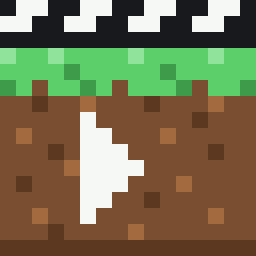
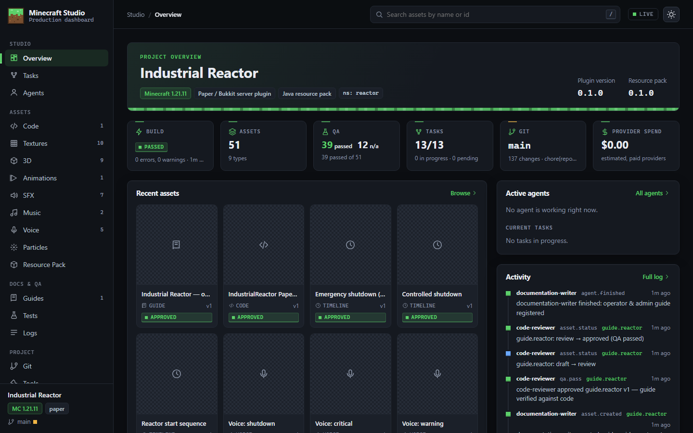
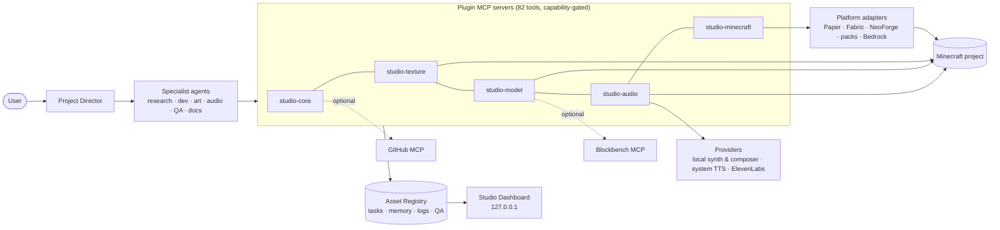
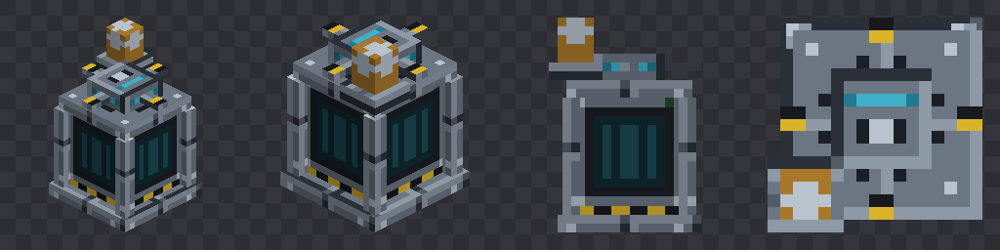
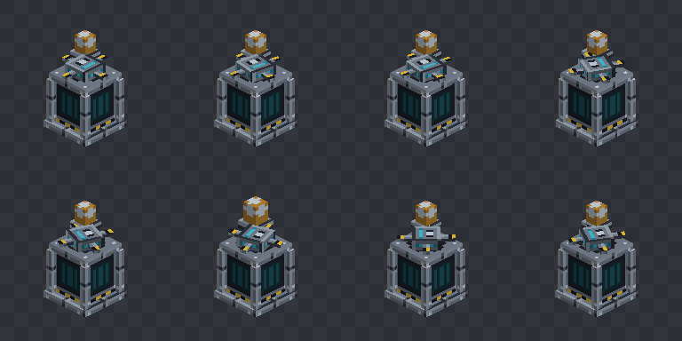
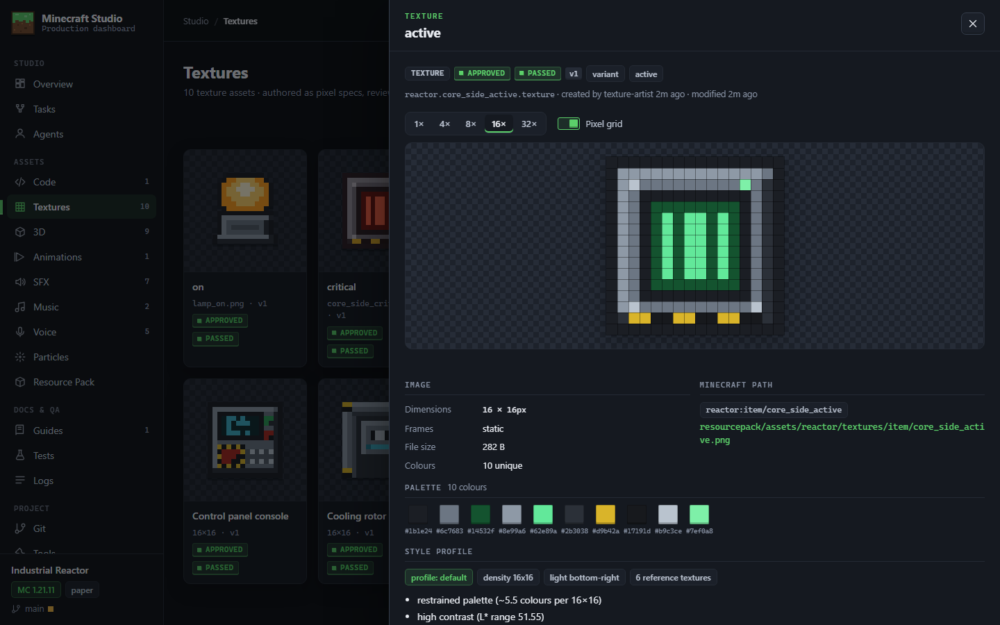

<div align="center">



# Minecraft Studio

**An AI production studio for Minecraft, powered by Claude**

Describe a feature. The plugin plans it, delegates the work to specialist agents, and produces textures, 3D models, animations, sound effects, adaptive music, voice lines and game code. Every result goes through QA, is documented and is committed. You can follow the whole production in a local Studio Dashboard.

[](.claude-plugin/plugin.json)
[](CHANGELOG.md)
[](docs/compatibility.md)
[](docs/mcp.md)
[](.github/workflows/ci.yml)
[](LICENSE)



</div>

## What it does

- 🎬 **Runs a studio, not a file generator.** A Project Director builds a dependency graph and hands each task to one of 14 specialist agents: researcher, developer, style analyst, texture artist, modeler, animator, SFX designer, composer, voice director, three QA roles and a docs writer.
- 🎨 **Matches your art style.** It measures your resource pack (palette, contrast, hue shift, noise, outline, lighting) and draws real pixel art against that profile. An off-style texture gets rejected.
- 🧊 **Makes models and animations it can see.** Exports to Java, Bedrock and Blockbench formats. It renders turnarounds and animation contact sheets and reviews them, rather than trusting that a valid file looks right.
- 🔊 **Treats audio as a system.** Layered SFX, adaptive music with stems and bar-quantised transitions, and voice lines with persistent voice profiles and a pronunciation dictionary that handles Russian stress. Everything is kept in sync on one timeline.
- ✅ **Gates everything through QA.** Asset registry with versions and an approval workflow, builds, unit tests, resource-pack validation, a Paper test-server smoke test, Git checkpoints with secret scanning, and a dashboard showing all of it.

## Quick start

```
/plugin marketplace add ArabKustam/Plugin-Minecraft-studio
/plugin install minecraft-studio@minecraft-studio
```

Restart Claude Code, open your Minecraft project, then:

```
/minecraft-studio:init
> Make an emergency reactor: equipment blocks, models, textures, startup animation, sirens,
  PA announcements, and calm + emergency music modes. Sync it with the game logic, test it,
  document it and commit to Git.
```

Requirements: Node ≥ 20. Recommended: Git, FFmpeg, and Java 21/25 for plugin work. ElevenLabs and Blockbench are optional. Full setup is in **[docs/installation.md](docs/installation.md)**, and `/minecraft-studio:doctor` checks everything.

---

## Contents

[Features](#features) · [How it works](#how-it-works) · [Architecture](#architecture) · [Gallery](#gallery) · [Demo](#industrial-reactor-demo) · [Dashboard](#studio-dashboard) · [Agents](#agents) · [Skills](#skills) · [Integrations](#integrations) · [Graceful degradation](#graceful-degradation) · [Development](#development) · [Roadmap](#roadmap) · [Security](#security) · [License](#license)

## Features

| Area | What you get |
|---|---|
| **Project understanding** | Detects the platform (Paper/Bukkit, Velocity, Fabric, NeoForge, datapack, resource pack, Bedrock, hybrids), Minecraft version, build system, namespaces, texture resolution, sounds, tests and CI. Then builds a project profile and memory. |
| **Planning** | Task dependency graph with delegation contracts (goal, inputs, outputs, allowed tools, constraints, quality, validation, destination). Independent tasks run as parallel agents. |
| **Textures** | Pixel-spec sources, style profiles and matching, palette pass, state variants (active / warning / critical / damaged…), tiling and validation checks, review sheets at 1600%, 800%, tiled and in-game size. |
| **Models** | Editable model sources → Java block/item models, Bedrock geometry, `.bbmodel` 5.0. Validation, software turnaround renders, Java model import, optional live Blockbench via MCP. |
| **Animation** | Bedrock/Blockbench animation format. Checks for snaps, loop seams and easing. Contact sheets. Item-display rigs for Paper. |
| **SFX** | Layered synth (oscillators, noise, FM, clicks, impacts, samples, filters, reverb, PA/radio effects, seamless loops), 12 presets, FFmpeg processing chain, LUFS audits, mono Ogg export with `sounds.json`. |
| **Music** | Scores with intro/loop/outro/stinger sections, stems, choir formants, BPM/key/bar metadata, transition points. The game logic switches music on bar lines. |
| **Voice** | Voice profiles, pronunciation dictionary (stress, aliases, numbers), ElevenLabs or local TTS, consistent processing. |
| **Timelines** | One timeline drives SFX, voice, animation, texture state, particles, lighting, music, UI and game state, compiled to ticks for the game. |
| **QA** | Asset lifecycle `idea → draft → review → approved → integrated`. Nothing is approved without a passing QA record for the current version. Visual QA, audio QA, code review, integration QA. |
| **Minecraft runtime** | Build and test through the platform adapters, resource-pack validation (broken references, formats), packaging with SHA-1, Paper test server with checksum-verified download and smoke tests. |
| **Git & GitHub** | Conventional-commit checkpoints of explicit paths with secret scanning. A pre-push secret guard. Works with the official GitHub MCP. |
| **Factories** | Agent Factory (validated new specialist agents) and Tool Factory (tested project tools). |
| **Dashboard** | 19 views: tasks graph, agent inspector, pixel-perfect texture zoom, 3D viewer, animation player, waveform audio, music stem mixer, guides, tests, logs, Git. |

## How it works

```
"Make a reactor…"
   │
   ▼
Project Director ── reads project profile + memory, checks Git
   │  studio_task_plan → dependency graph
   ├─► Researcher          official docs, API versions        → docs/research, memory
   ├─► Style Analyst       style-profile.json
   │     └─► Texture Artist  pixel specs → PNG → style compare → variants
   │           └─► Modeler     sources → Java / Bedrock / .bbmodel → turnaround review
   │                 └─► Animator  keyframes → contact sheets
   ├─► SFX Designer ║ Composer ║ Voice Director     (parallel)
   ├─► Minecraft Developer   code, state machine, timeline player, music director
   ▼
Visual QA · Audio QA · Code Reviewer   →  approve / request changes (versioned)
   ▼
Timeline (sync) → Integration QA (pack, registry, build, tests, test server)
   ▼
Documentation Writer → Git checkpoints → Dashboard → report
```

## Architecture



There are four layers: plugin → agents/skills → orchestration → tools/MCP/providers. Registry, memory, QA and the dashboard sit beside them. See **[docs/architecture.md](docs/architecture.md)** and the [ADRs](docs/adr/).

## Gallery

Everything below comes from the real Industrial Reactor demo, produced by the studio pipeline. None of it is a mock-up.

| | |
|---|---|
| **Pixel-art texture set** (existing pack + new reactor parts) <br> | **Consistent state variants** (off → active → warning → critical) <br> |
| **Model turnaround** (assembly rig, software-rendered for QA) <br> | **Startup animation contact sheet** (rotor anticipation & spin-up) <br> |
| **Dashboard: textures** <br> | **Dashboard: 3D viewer** <br> |
| **Dashboard: adaptive music & stem mixer** <br> | **Dashboard: production graph** <br> |

> An in-game Minecraft screenshot isn't included yet. Running the test server needs your Minecraft EULA consent, and a client capture needs a game client. See [Roadmap](#roadmap).

## Industrial Reactor demo

[`examples/industrial-reactor`](examples/industrial-reactor) is an end-to-end integration test of the whole studio:

- **Paper 1.21.11 plugin**: reactor state machine (off → starting → running → warning → critical → failed), heat simulation, display-entity rig (core, spinning rotor, blinking lamp), control-panel GUI, commands and permissions, persistence, timeline player, adaptive music director with bar-quantised transitions, voice rate-limiting, `selftest`. 52 classes and 81 unit tests.
- **Resource pack** made by the studio:
  - 16 textures, including state variants
  - 8 item models with item definitions
  - 7 layered SFX
  - 2 adaptive music cues with stems and metadata
  - 5 Russian PA announcements with a pronunciation dictionary
  - 3 timelines
- **Studio state**: 51 registered assets with sources, versions and QA, 13 production tasks, project memory, activity log, test runs, and an [operator guide](examples/industrial-reactor/docs/guides/reactor.md).

Reproduce the whole production with real MCP calls:

```bash
node examples/industrial-reactor/studio/produce.mjs --fresh
```

[`examples/style-match`](examples/style-match) is the "new block indistinguishable from the pack" test. A hatch drawn from the style profile scores ≥ 75; an off-style control scores < 55.

## Studio Dashboard

`/minecraft-studio:dashboard` starts a local, read-only web app at `http://127.0.0.1:4777`. Views: Overview · Tasks · Agents · Code · Textures · 3D · Animations · SFX · Music · Voice · Particles · Resource Pack · Guides · Tests · Logs · Git · Tools · References · Settings. Details are in **[docs/dashboard.md](docs/dashboard.md)**.

## Agents

`project-director` · `researcher` · `minecraft-developer` · `style-analyst` · `texture-artist` · `modeler` · `animator` · `sfx-designer` · `composer` · `voice-director` · `visual-qa` · `audio-qa` · `code-reviewer` · `integration-qa` · `documentation-writer`

Each agent gets only the tools it needs. QA agents record verdicts but never fix their own findings. Roles, contracts and the Agent Factory are in **[docs/agents.md](docs/agents.md)**.

## Skills

The core `minecraft-studio` skill is short and links to 16 reference files that load only when needed. Eight specialist workflow skills cover textures, models, animation, sound, music, voice, development and QA, plus `/minecraft-studio:init`, `:doctor` and `:dashboard`. See **[docs/skills.md](docs/skills.md)**.

## Integrations

| Integration | Status | Used for |
|---|---|---|
| ElevenLabs | optional (key in secure plugin storage or env) | production voice, AI SFX, AI music, all behind a cost gate |
| Blockbench MCP (sosadly / jasonjgardner) | optional | live modelling, painting, screenshots |
| GitHub MCP / `gh` | optional | repositories, PRs, releases, CI |
| FFmpeg | recommended | Ogg Vorbis export, processing |
| System TTS (SAPI / say / eSpeak NG) | built in | draft voices |

See **[docs/integrations.md](docs/integrations.md)** and the **[compatibility matrix](docs/compatibility.md)**. The matrix only claims what was actually tested.

## Graceful degradation

| Missing | What still works |
|---|---|
| ElevenLabs | voice falls back to system TTS (flagged as draft); SFX and music use the local synth and composer |
| Blockbench | built-in exporters, `.bbmodel` output and the software renderer |
| GitHub | local Git checkpoints |
| FFmpeg | synthesis, analysis and WAV masters. Ogg export reports what's missing. |
| Minecraft EULA not accepted | builds, unit tests and static validation; the test server stays off |
| Image generator | pixel-spec authoring (the default for 16×16), style analysis, editing existing textures |

## Development

```bash
cd runtime && npm ci && npm run build && cd ..
node --test "tests/**/*.test.mjs"      # unit + integration through real MCP servers
node scripts/validate-plugin.mjs       # official validator + agent/skill tool references
node scripts/package-plugin.mjs        # dist/minecraft-studio.plugin + SHA256SUMS
claude --plugin-dir .                  # try your checkout
```

See [CONTRIBUTING.md](CONTRIBUTING.md), [docs/plugin-development.md](docs/plugin-development.md) and [docs/testing.md](docs/testing.md).

## Roadmap

- In-game capture pipeline (test server + headless client) for real Minecraft screenshots in QA
- Particle designer (custom particle JSON + sprite sheets) and a GUI layout validator
- Gradle-based demo on Paper 26.x / Java 25; Fabric and NeoForge example projects
- Optional image-model provider for high-res concept art (always followed by pixel cleanup)
- Live sound preview in-game via a debug command; per-stem intensity layering in the demo plugin
- Animated GIF/video export from animation contact sheets

## Security

The plugin follows least privilege. Tools are tagged read/write/execute/publish. It validates every path, never puts secrets into files or logs, scans for secrets on write, commit and push, binds the dashboard to localhost read-only, checksum-verifies server downloads, sends no telemetry, and asks before paid generations or accepting the EULA. See **[SECURITY.md](SECURITY.md)**.

## License

[MIT](LICENSE). Bundled third-party packages are listed in [THIRD_PARTY_NOTICES.md](THIRD_PARTY_NOTICES.md). Blockbench, FFmpeg, Paper and eSpeak NG are separate tools the plugin can call; they are not bundled.
