<div align="center">

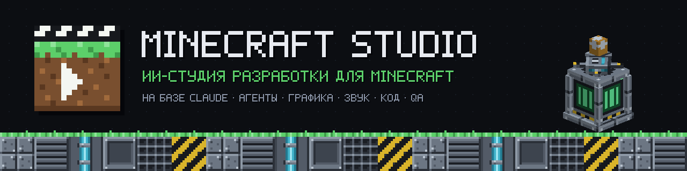

**[Установка](#установка)** · **[Быстрый старт](#быстрый-старт)** · **[Документация](docs/)** · **[Демо-проект](examples/industrial-reactor)** · **[Сообщить об ошибке](https://github.com/ArabKustam/Plugin-Minecraft-studio/issues/new/choose)** · **[🇬🇧 English](README.md)**

[](CHANGELOG.md)
[](https://github.com/ArabKustam/Plugin-Minecraft-studio/actions/workflows/ci.yml)
[](.claude-plugin/plugin.json)
[](docs/compatibility.md)
[](docs/mcp.md)
[](LICENSE)

</div>

**Minecraft Studio** — плагин для Claude Code, который превращает Claude в небольшую студию разработки игр. Вы описываете задачу, например «аварийный реактор с сиренами, голосом оповещения и адаптивной музыкой». Агент «Директор проекта» раскладывает её на граф задач и распределяет работу между 14 агентами-специалистами. Текстуры, модели, анимации, звуки, музыка, голосовые реплики и код проходят QA, документируются и коммитятся в Git. За работой можно следить в локальном дашборде.

<div align="center">
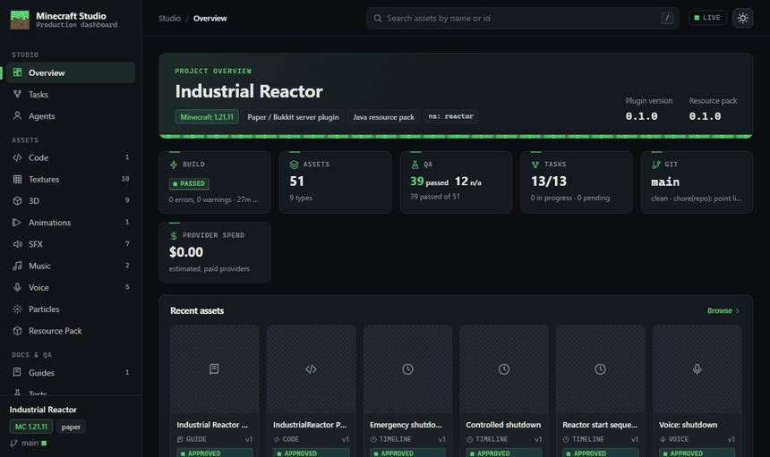
<br><sub>Настоящий Studio Dashboard на встроенном демо Industrial Reactor. Все ассеты в нём сделаны конвейером самого плагина. Интерфейс дашборда пока только на английском.</sub>
</div>

---


**Директор проекта** читает ваш проект и его память, проверяет Git и делит запрос на задачи. У каждой задачи есть контракт: цель, входы, выходы, разрешённые инструменты, ограничения, критерии качества и папка, куда класть результат. Независимые задачи выполняются параллельно. В дашборде видны все задачи, агенты и результаты.

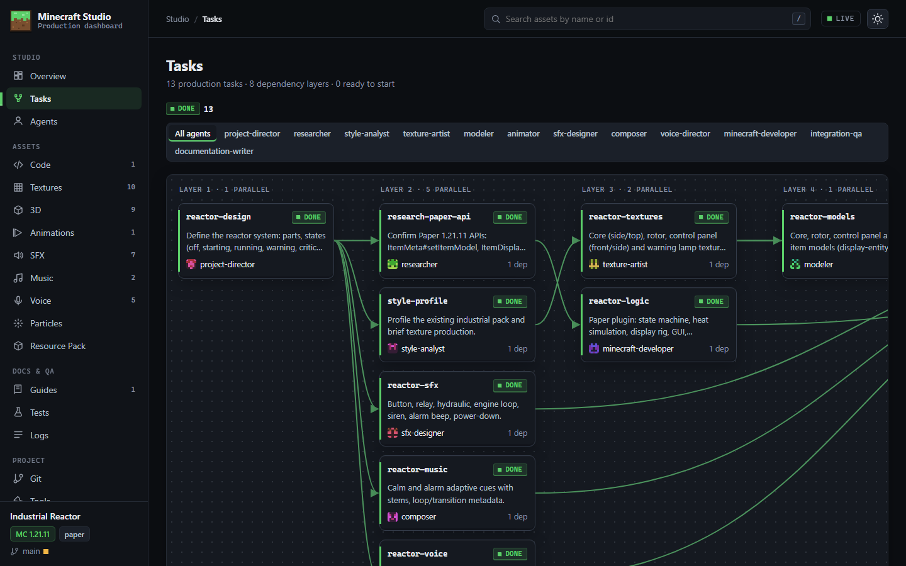

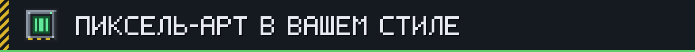

Студия **измеряет ваш ресурспак**: палитру, контраст, насыщенность, сдвиг оттенка от теней к бликам, обводку, шум, дизеринг и направление света. По этому профилю «Художник текстур» рисует настоящий пиксель-арт, а не уменьшает ИИ-картинки. Каждая новая текстура получает оценку соответствия паку, неподходящие по стилю возвращаются на доработку. Варианты состояний строятся из одной базы, поэтому все они читаются как один и тот же объект.

<p align="center">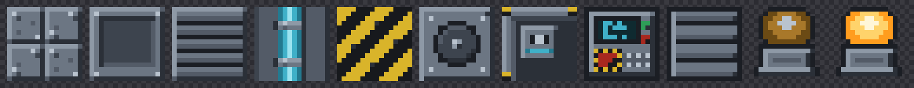<br>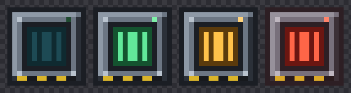</p>

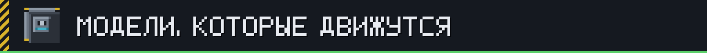

Модели пишутся как редактируемые исходники и экспортируются в **модели блоков и предметов Java, геометрию Bedrock и `.bbmodel` для Blockbench**. Анимации получают замах, сглаживание и бесшовные циклы. Перед QA студия рендерит модель с четырёх сторон и раскадровку анимации и **смотрит на результат**: файл, который проходит валидацию, ещё не значит хороший. Через опциональный MCP-мост можно управлять Blockbench вживую.

<p align="center">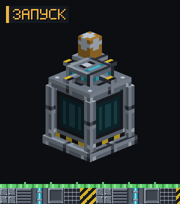 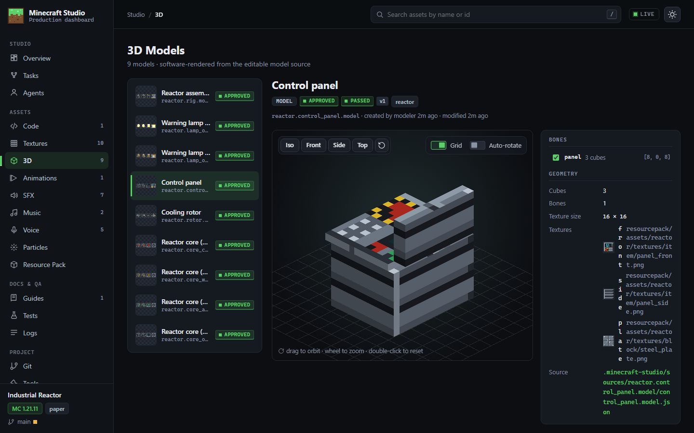</p>


- **Звуковые эффекты** собираются из слоёв: тон, мотор, щелчок, акустика помещения, эффект громкоговорителя. Громкость выравнивается по LUFS, результат экспортируется в моно Ogg Vorbis вместе с записями в `sounds.json`.
- **Музыка** записывается как партитура с секциями вступления, цикла и стингера, стемами и метаданными BPM, тональности и тактов. Поэтому игра переключает музыку ровно на границе такта.
- **Голосовые реплики** звучат одним персонажем на десятках записей благодаря голосовым профилям и словарю произношения с русскими ударениями. Озвучка идёт через ElevenLabs, если он подключён, иначе через системный TTS.

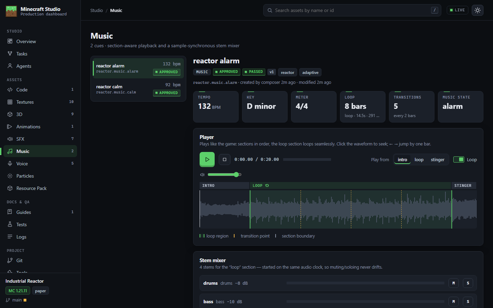

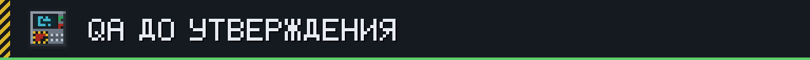

Ассет получает статус **approved** только после пройденной QA-проверки текущей версии. Проверки делятся на визуальные, звуковые, ревью кода и интеграционные. Среди них:

- сборка и юнит-тесты;
- валидация ресурспака: битые ссылки, форматы;
- целостность реестра ассетов;
- сверка таймлайнов с `sounds.json`;
- опционально — смоук-тест `selftest` на временном сервере Paper.

Git-чекпоинты — это Conventional Commits только указанных путей, с проверкой на секреты.

## Как это работает

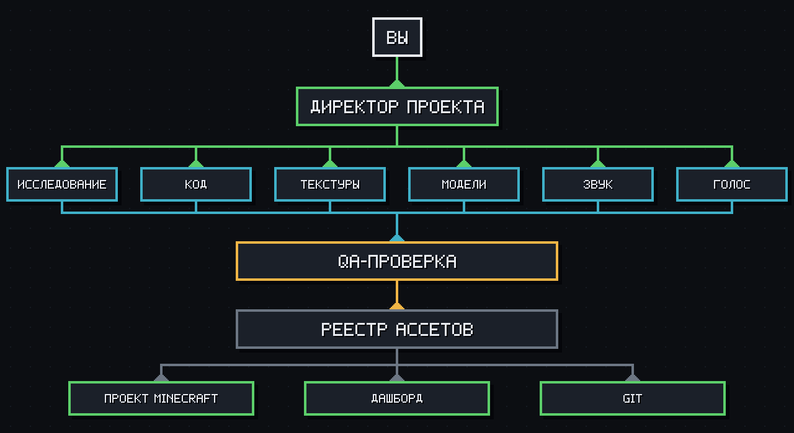

Плагин состоит из четырёх слоёв:

1. **Плагин Claude** — skills, агенты и хуки.
2. **Агенты.**
3. **Оркестрация** — граф задач, таймлайны и жизненный цикл QA.
4. **Пять MCP-серверов** — `studio-core`, `studio-texture`, `studio-model`, `studio-audio`, `studio-minecraft`.

Внешние сервисы подключаются через адаптеры: ElevenLabs, системный TTS, Blockbench MCP, GitHub MCP, а также Paper, Fabric, NeoForge, ресурспаки и Bedrock. Всё состояние хранится в обычных JSON-файлах в папке `.minecraft-studio/` вашего проекта. [Архитектура →](docs/architecture.md)

## Требования

| | Для чего |
|---|---|
| **Claude Code** (CLI или десктоп) | запуск плагина; Cowork может установить файл `.plugin` |
| **Node.js ≥ 20** | встроенные MCP-серверы (без `npm install`) |
| Git | чекпоинты и история *(рекомендуется)* |
| FFmpeg с libvorbis | экспорт Ogg для Minecraft *(рекомендуется)* |
| Java 21 (MC ≤ 1.21.11) или 25 (MC 26.x) + Maven/Gradle | сборка и тесты плагинов и модов |
| Ключ ElevenLabs | качественные голоса, ИИ-звуки и музыка *(опционально)* |
| Blockbench + MCP-мост | живое редактирование моделей *(опционально)* |

## Установка

```
/plugin marketplace add ArabKustam/Plugin-Minecraft-studio
/plugin install minecraft-studio@minecraft-studio
```

После установки перезапустите Claude Code. Чтобы попробовать локальную копию без установки, запустите `claude --plugin-dir /путь/к/Plugin-Minecraft-studio`. Подробности, в том числе установка файла `.plugin` в Cowork, — в [docs/installation.md](docs/installation.md) (на английском).

## Быстрый старт

```
cd my-minecraft-project
claude
> /minecraft-studio:init
> Сделай блок промышленной панели управления в стиле моего ресурспака,
  с анимированным экраном и звуком нажатия кнопки.
```

`init` анализирует проект и спрашивает платформу и версию, если они неочевидны. Затем он индексирует существующие ассеты, снимает профиль стиля текстур и открывает дашборд. Проверить окружение можно в любой момент командой `/minecraft-studio:doctor`.

## Настройка

Настройки лежат в `.minecraft-studio/config.json`, Claude меняет их через `studio_config_set`. Секреты там никогда не хранятся.

| Ключ | По умолчанию | Значение |
|---|---|---|
| `providers.voice` | `auto` | `auto` (ElevenLabs → системный TTS → заглушка), `elevenlabs`, `system`, `mock` |
| `providers.sfx` / `providers.music` | `local-synth` / `local-composer` | локальные генераторы; инструменты ElevenLabs отдельные и спрашивают подтверждение расходов |
| `audio.master_format` | `flac` | формат мастер-файлов без потерь (`wav`, если нет FFmpeg) |
| `costs.max_generations_per_asset` | `6` | лимит платных генераций на один ассет |
| `dashboard.port` | `4777` | порт дашборда (всегда только 127.0.0.1) |
| `minecraft.accept_eula` | `false` | включает тестовый сервер Paper; ставьте только после того, как **вы** приняли EULA Minecraft |
| `minecraft.startup_timeout_s` | `180` | таймаут запуска тестового сервера |

| Переменная окружения | Назначение |
|---|---|
| `ELEVENLABS_API_KEY` | ключ ElevenLabs: переменная окружения или `.env` проекта (настройка плагина читается только там, где Claude Code передаёт её MCP-серверам) |
| `MINECRAFT_STUDIO_CAPABILITIES` | ограничивает MCP-сервер инструментами уровней `read`, `write`, `execute` или `publish` |
| `MINECRAFT_STUDIO_FFMPEG` | путь к конкретному FFmpeg |

## Команды

| Slash-команда | Что делает |
|---|---|
| `/minecraft-studio:init` | анализ и инициализация проекта, профиль стиля, запуск дашборда |
| `/minecraft-studio:doctor` | диагностика Node, Git, Java, FFmpeg, TTS, ElevenLabs, Blockbench, GitHub и дашборда |
| `/minecraft-studio:dashboard` | открыть Studio Dashboard |

Хуки и CI используют CLI `node runtime/dist/cli.mjs <команда>`. Доступные команды: `doctor`, `init`, `analyze`, `status`, `integrity`, `dashboard`, `validate-pack <папка>`, `package-pack <папка> <zip>`, `scan-secrets`.

## API

Агенты работают через MCP-инструменты, например `mcp__plugin_minecraft-studio_studio-texture__texture_render_spec`. Каждый генерирующий инструмент принимает блок `asset`: результат регистрируется в реестре вместе с исходником, из которого его можно воспроизвести.

```jsonc
// texture_render_spec: исходник — палитра и по одному символу на пиксель
{
  "spec": {
    "size": [16, 16],
    "palette": { "o": "#1b1e24", "l": "#6c7683", "h": "#8e99a6", "g": "#62e89a" },
    "rows": ["oooooooooooooooo", "ohhhhhhhhhhhhhlo", "…ещё 14 строк…"]
  },
  "output": "resourcepack/assets/reactor/textures/item/core_side_active.png",
  "purpose": "item",
  "asset": { "id": "reactor.core_side_active.texture", "minecraft_ids": ["reactor:item/core_side_active"], "agent": "texture-artist" }
}
// → PNG записан, исходник сохранён, лист для проверки вернулся картинкой, ассет зарегистрирован как черновик (ждёт QA)
```

Таймлайн синхронизирует все виды медиа. Код игры выполняет скомпилированный список тиков:

```json
{ "id": "reactor_startup", "duration": 5, "tracks": {
    "sfx":       [{ "t": 0.0, "sound": "reactor:reactor.button" }, { "t": 0.4, "sound": "reactor:reactor.relay" }],
    "voice":     [{ "t": 0.15, "line": "startup", "sound": "reactor:reactor.voice.startup" }],
    "animation": [{ "t": 1.4, "animation": "spin_up", "target": "rotor", "duration": 2.0 }],
    "texture":   [{ "t": 3.5, "state": "active" }],
    "music":     [{ "t": 4.0, "action": "transition", "state": "calm", "quantize": "bar" }],
    "state":     [{ "t": 5.0, "state": "RUNNING" }] } }
```

Все 88 инструментов описаны в [docs/mcp.md](docs/mcp.md), форматы файлов — в виде [JSON Schema](schemas/).

## Примеры

### 🐾 [Набор существ](examples/creatures): 3 животных, 2 монстра, 2 антропоморфных персонажа

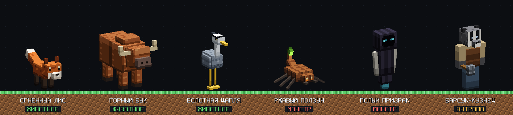

<div align="center">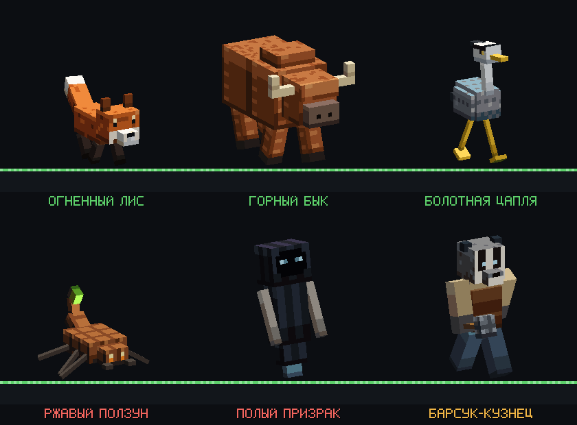</div>

<div align="center">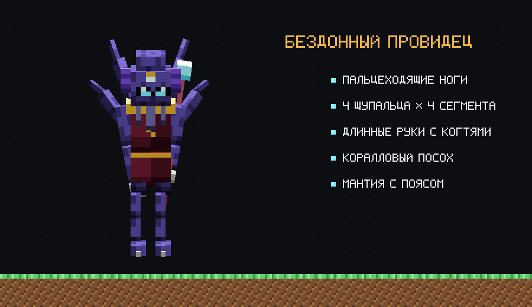<br><sub>Бездонный провидец — антропоморфный, но не похожий на игрока: пальцеходящие ноги, четыре сегментированных щупальца из спины, которые движутся волной, длинные руки с когтями, коралловый посох и мантия.</sub></div>

| Существо | Тип | Риг и анимации | Звуки |
|---|---|---|---|
| **Огненный лис** | животное | четвероногое · покой, рысь, прыжок-атака | тявканье, визг, рычание |
| **Горный бык** | животное | лохматое четвероногое с рогами · пасётся, шаг, удар головой | низкий зов, боль, удар |
| **Болотная цапля** | животное | длинноногая птица · покой, шаг, клевок, взмах крыльями | кваканье, крик, щелчки клюва |
| **Ржавый ползун** | монстр | шестиногий скорпион из металлолома · походка «треногой», удар жалом | стрекот, шипение, жало |
| **Полый призрак** | монстр | парящий дух в капюшоне · парение, дрейф, вопль | шёпот, стон, вопль |
| **Барсук-кузнец** | антропоморфный | барсук-гуманоид с молотом · шаг, удар молотом, работа у наковальни | звон наковальни, кряхтение, удар |
| **Бездонный провидец** | антропоморфный | пальцеходящие ноги, 4 щупальца по 4 сегмента, длинные руки с когтями, посох, мантия · волна щупалец, пальцеходящая походка, заклинание посохом | напев и пузыри, боль, заклинание |

Что есть у каждого существа:

- атлас текстур, нарисованный инструментом `texture_paint_uv`;
- геометрия и анимации Bedrock;
- клиентская и поведенческая сущности с яйцом призыва;
- 3 звука;
- проект `.bbmodel` для Blockbench.

Всё упаковано в `studio-creatures.mcaddon`. Аддон проходит Bedrock-валидатор студии, но в клиенте Bedrock пока не запускался. Описание существ — в [руководстве](examples/creatures/docs/creatures.md) (на английском).

### ⚔️ [Арсенал и сад](examples/armory): оружие, инструменты, луки, посохи, фрукты, броня и одежда

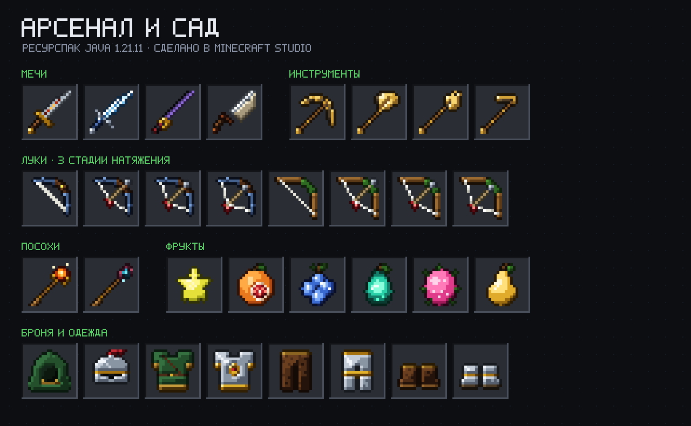

<div align="center">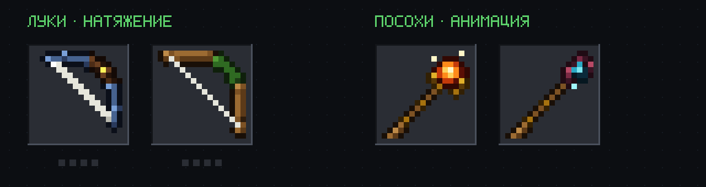</div>

<div align="center">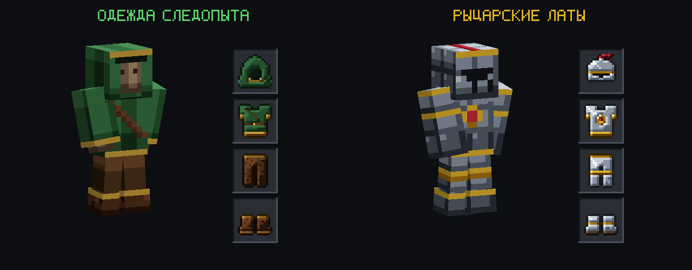</div>

Это ресурспак для Java 1.21.11. Модов не нужно: обычные ванильные предметы получают новый вид через компоненты `item_model` и `equippable`.

- **Оружие, инструменты и фрукты** — 32 иконки. Каждая нарисована как силуэт, размеченный по частям, а затем `texture_shade_item` добавляет свет, тени на кромках, блеск металла, текстуру дерева, свечение камней и цветной контур.
- **Луки** — у каждого 3 стадии натяжения и item definition, который выбирает стадию так же, как у ванильного лука.
- **Посохи** — кристаллы пульсируют через `.mcmeta`.
- **Одежда и броня** — два комплекта, *одежда следопыта* и *рыцарские латы*. Они нарисованы на ванильных раскладках `humanoid` и `humanoid_leggings` и показаны на манекене. Там, где броня не закрывает тело, текстура прозрачная, и тело видно.

Пак проходит валидатор ресурспаков студии, но в клиенте Minecraft ещё не запускался. В [руководстве](examples/armory/docs/armory.md) (на английском) для каждого предмета есть команда `/give`.

### 🧪 Industrial Reactor

[`examples/industrial-reactor`](examples/industrial-reactor) — сквозной интеграционный тест всей студии.

- **Плагин Paper 1.21.11** (52 класса, 81 юнит-тест), в нём:
  - машина состояний реактора и симуляция нагрева;
  - вращающийся ротор и мигающая лампа на display-сущностях;
  - GUI панели управления;
  - адаптивная музыка с переходами по тактам;
  - команда `selftest`.
- **Ресурспак, сделанный студией:** 16 текстур, 8 моделей, 7 звуков, 2 музыкальные темы со стемами, 5 голосовых объявлений на русском, 3 таймлайна.
- **Состояние студии:** 51 ассет с историей QA и [инструкция оператора](examples/industrial-reactor/docs/guides/reactor.md).

Всё производство можно воспроизвести реальными MCP-вызовами командой `node examples/industrial-reactor/studio/produce.mjs --fresh`.

## FAQ

<details><summary><b>Нужны ли API-ключи?</b></summary>

Нет. Текстуры, модели, анимации, звуки, музыка и черновые голоса работают локально. ElevenLabs опционален: он даёт качественные голоса и всегда спрашивает разрешение, прежде чем тратить кредиты.
</details>

<details><summary><b>Какие версии и платформы Minecraft поддерживаются?</b></summary>

Демо-плагин для Paper 1.21.11 собран и покрыт юнит-тестами. Paper 26.x определяется: студия знает его форматы паков и требование Java 25. Fabric, NeoForge, датапаки, ресурспаки, Bedrock и прокси определяются через адаптеры. В [матрице совместимости](docs/compatibility.md) проверенное отделено от ожидаемого.
</details>

<details><summary><b>Подойдёт ли для моего существующего проекта и ресурспака?</b></summary>

Да, это основной сценарий. `init` индексирует ваши ассеты, ничего в них не меняя. Новые текстуры подгоняются под измеренный стиль пака, а код следует вашей архитектуре и соглашениям.
</details>

<details><summary><b>Почему пиксельные спецификации, а не генератор картинок?</b></summary>

В текстуре 16×16 важен каждый кластер пикселей, а уменьшенные ИИ-картинки превращаются в шум. Исходник «палитра + сетка символов» даёт читаемые и редактируемые текстуры: просьба «сделай чуть темнее» превращается в правку одной строки и новую версию. Концепт в высоком разрешении тоже можно уменьшить до нужного размера и потом дочистить вручную.
</details>

<details><summary><b>Нужен ли Blockbench?</b></summary>

Нет. Встроенные экспортёры и рендерер покрывают весь конвейер, а файлы `.bbmodel` открываются в Blockbench для ручной доводки. Про живое управление Blockbench читайте в разделе [интеграция с Blockbench](docs/modeling.md#blockbench).
</details>

<details><summary><b>Куда-нибудь отправляются данные проекта?</b></summary>

Телеметрии нет. Данные уходят только тем провайдерам, которых вы сами настроили и одобрили. Секреты хранятся в переменных окружения или защищённом хранилище и не попадают в файлы, логи и коммиты. Дашборд локальный и работает только на чтение. Подробнее в [SECURITY.md](SECURITY.md).
</details>

## Поддержка

- 📖 [Документация](docs/) (на английском) · [Установка](docs/installation.md) · [Архитектура](docs/architecture.md) · [Тестирование](docs/testing.md)
- 🐞 [Ошибки, проблемы совместимости, качество ассетов](https://github.com/ArabKustam/Plugin-Minecraft-studio/issues/new/choose)
- 🔒 [Сообщить об уязвимости приватно](SECURITY.md)
- 🤝 [Как помочь проекту](CONTRIBUTING.md) · [Список изменений](CHANGELOG.md)

## Лицензия

[MIT](LICENSE). Сторонние пакеты, которые входят в сборку, перечислены в [THIRD_PARTY_NOTICES.md](THIRD_PARTY_NOTICES.md). Blockbench, FFmpeg, Paper и eSpeak NG — отдельные программы: плагин их вызывает, но не включает в себя. Проект не связан с Mojang, Microsoft или Anthropic.
