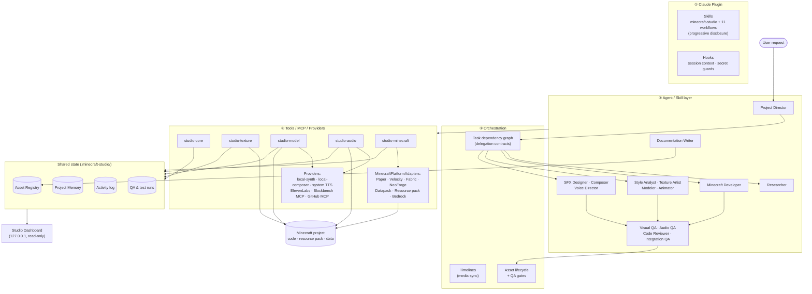

# Architecture

Minecraft Studio has four layers. The cross-cutting state sits beside them.



## Principles

1. **Workflow, not chaos.** Significant changes go through tasks, a registry and QA. Generation tools register their outputs with a reproducible source, and nothing reaches `approved` without a passing QA record for the current version.
2. **Adapters at every external edge.** Image, SFX, music, voice and modelling providers, Minecraft platforms and Git hosting all sit behind interfaces ([providers.md](providers.md), [minecraft-platforms.md](minecraft-platforms.md)). No business logic depends on one vendor.
3. **Separate MCP servers by concern and capability.** Five small servers, each tool tagged `read`/`write`/`execute`/`publish`, so least privilege can be configured ([mcp.md](mcp.md)).
4. **State on disk, not in chat.** `.minecraft-studio/` holds the profile, assets with their versions, tasks, memory, timelines, logs and QA. It is committed with the project and becomes its production history.
5. **Visual and audible evidence.** Tools return review images (texture sheets, model turnarounds, animation contact sheets) and audio audits, so agents judge results on evidence, not on whether a file is merely valid.
6. **Graceful degradation.** Every optional integration has a local fallback, or the doctor reports clearly that it's missing.

## Runtime

```
runtime/src/
  lib/core        studio state (registry, tasks, memory, log, QA), project analysis, git, secrets, timeline, factories, doctor
  lib/texture     PNG/colour, pixel specs, style analysis, texture ops & previews
  lib/model       model source, exporters (Java/Bedrock/.bbmodel), software renderer, animation
  lib/audio       WAV, DSP, synth, music composer, analysis/LUFS, ffmpeg adapter, voice
  lib/providers   provider registry (ElevenLabs, system TTS, mock, local)
  lib/adapters    MinecraftPlatformAdapters
  lib/minecraft   resource-pack integration, build/test runner, Paper test server
  mcp/            five MCP servers (thin wrappers) + shared plumbing
  dashboard/      HTTP API for the dashboard
  cli/            `studio` CLI (hooks, CI, humans)
```

esbuild bundles the runtime into `runtime/dist/*.mjs` with shared chunks. The bundle is committed, so installing the plugin never runs `npm install`.

## Data flow of one asset

```
task (texture-artist) → texture_render_spec {spec, asset}
   ├─ writes PNG into the resource pack
   ├─ stores the spec in .minecraft-studio/sources/<id>/
   ├─ renders a review sheet → previews/<id>.png (returned to Claude as an image)
   └─ registers/versions the asset (draft, qa pending), logs activity
visual-qa → texture_style_compare / texture_validate → studio_qa_record (pass → approved)
modeler → model_export (depends on texture asset) → …
integration-qa → mc_resourcepack_validate, studio_registry_integrity, mc_build …
director → studio_git_checkpoint → dashboard
```

See also [ADRs](adr/) for the main decisions.
